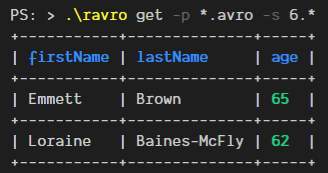

# ravro


A CLI for [Apache Avro](https://avro.apache.org/) manipulations.



> **⚠ Under heavy development ⚠**
>
> Please use at your own discretion.

---

## Installation

### Compile from Source

Use `cargo`:

```
cargo build --release
```

### Binaries

There are existing compiled binaries for Windows at the moment.
They can be downloaded from the [releases](https://github.com/guywald1/ravro/releases) page.

## Usage

```shell
> # Retrieve all columns for a list of records
> ravro get .\test_assets\bttf.avro

+-----------+--------------+-----+
| firstName | lastName     | age |
+-----------+--------------+-----+
| Marty     | McFly        | 24  |
+-----------+--------------+-----+
| Biff      | Tannen       | 72  |
+-----------+--------------+-----+
| Emmett    | Brown        | 65  |
+-----------+--------------+-----+
| Loraine   | Baines-McFly | 62  |
+-----------+--------------+-----+

> # Search (using regular expressions)
> ravro get .\test_assets\bttf.avro --search McFly

+-----------+--------------+-----+
| firstName | lastName     | age |
+-----------+--------------+-----+
| Marty     | McFly        | 24  | # the second field will appear in bold green here
+-----------+--------------+-----+
| Loraine   | Baines-McFly | 62  | # the second field will appear in bold green here
+-----------+--------------+-----+

> # Select only some columns
> ravro get .\test_assets\bttf.avro --fields firstName age

+-----------+-----+
| firstName | age |
+-----------+-----+
| Marty     | 24  |
+-----------+-----+
| Biff      | 72  |
+-----------+-----+
| Emmett    | 65  |
+-----------+-----+
| Loraine   | 62  |
+-----------+-----+

> # Select the first 2 columns
> ravro get .\test_assets\bttf*.avro --fields firstName age --take 2

+-----------+-----+
| firstName | age |
+-----------+-----+
| Marty     | 24  |
+-----------+-----+
| Biff      | 72  |
+-----------+-----+

> # Output as CSV
> ravro get .\test_assets\bttf*.avro --fields firstName age --take 2 --format csv

firstName,age
Marty,24
Biff,72
```

## Options

- `fields (f)` - The list (separated by spaces) of the fields you wish to retrieve
- `search (s)` - The regular expression to filter and display only rows with columns that contain matching values. The matching fields will be highlighed
- `take (t)` - The number of records you wish to retrieve
- `codec (c)` - The codec for decompression - omit for no codec, or specify "deflate"
- `format (p)` - The format you wish to output the Avro - omit for a pretty print as a table, or specify "csv" for CSV

## TODO

- Parquet support using [Arrow's Parquet crate](https://github.com/apache/arrow/tree/master/rust/parquet)
- Extract CLI functionality into a library
- More display formats
- Avro generation from JSON
- Schema
- `Snappy` codec

## Caveats

- The schema is inferred based on the first record it finds. This may not be desired for some use-cases
- Only supports top-level records at the moment

---

## Contributions

Are very welcome! I am by no means an expert on Spark, Avro or even Rust and there is _much_ to be improved here.


## Thanks 🙏

- [avro-rs](https://github.com/flavray/avro-rs)
