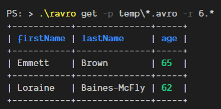

# ravro

A CLI for [Apache Avro](https://avro.apache.org/) manipulations, written in Rust.



> **⚠ Under heavily development ⚠**
>
> Please use at your own discretion.

---

## Installation

### Compile from Source

Use `cargo`:

```
cargo build --release
```

### Binaries

There are existing compiled binaries for Windows at the moment.
They can be downloaded from the [releases](https://github.com/guywald1/ravro/releases) page.

## Usage

```shell
> # Retrieve all columns for a list of records
> rargo get .\bttf.avro

+---------------+--------------+-------------+
| firstName     | lastName     | nickname    |
+---------------+--------------+-------------+
| Marty         | McFly        | Marty       |
+---------------+--------------+-------------+
| Emmett        | Brown        | Doc         |
+---------------+--------------+-------------+
| Biff          | Tannen       | Biff        |
+---------------+--------------+-------------+

> # Search (using regular expressions)
> rargo get .\bttf.avro --search McFly

+---------------+--------------+-------------+
| firstName     | lastName     | nickname    |
+---------------+--------------+-------------+
| Marty         | McFly        | Marty       | # McFly should appear in bold green here
+---------------+--------------+-------------+

> # Select only some columns
> rargo get .\bttf.avro --fields firstName nickname

+---------------+--------------+
| firstName     | nickname     |
+---------------+--------------+
| Marty         | Marty        |
+---------------+--------------+
| Emmett        | Doc          |
+---------------+--------------+
| Biff          | Biff         |
+---------------+--------------+
```

## Options

- `fields (f)` - select only the fields you wish to retrieve
- `path (p)` - a glob to one or multiple Avro files
- `search (s)` - A regular expression to filter and display only rows with columns that contain matching values. The matching fields will be highlighed
- `codec (c)` - The codec for decompression - omit for no codec, or specify "deflate"

## TODO

- Configurable display formats (CSV, JSON, etc.)
- Avro generation from JSON
- Schema

## Caveats

- Only supports top-level records right now
- Snappy not included